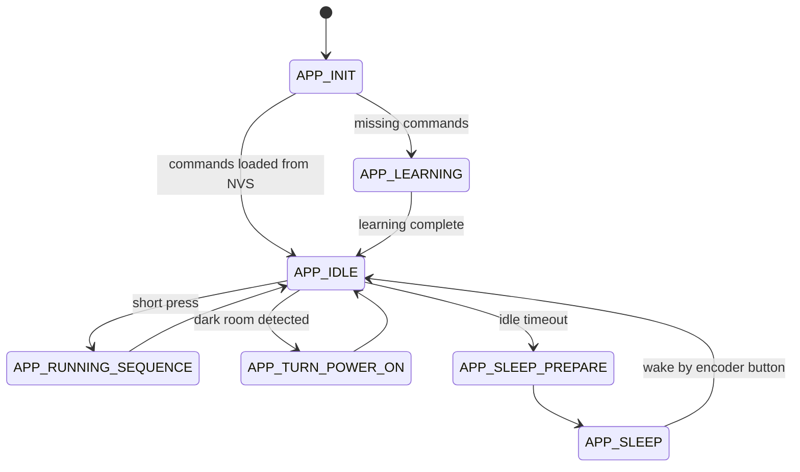
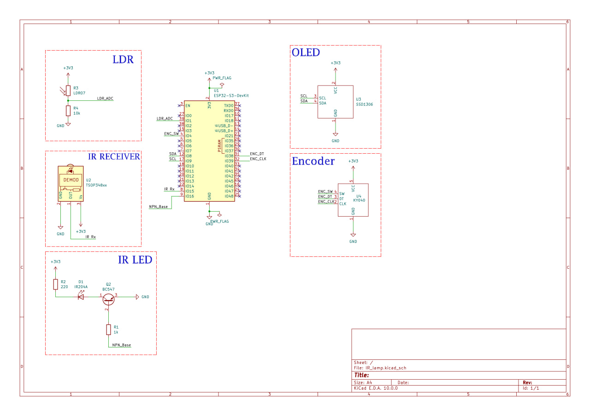

# IR lamp controller

## IR Lamp Controller is an ESP32-S3 based embedded project for controlling an ambient lamp through infrared commands.

The controller learns IR commands from the original remote, stores them in NVS flash memory, and replays them using an IR LED. This allows simple remote commands to be combined into more complex scenes.

The project is built with ESP-IDF and focuses on embedded firmware architecture, IR signal handling, persistent storage, finite state machine design, sensor-based automation, and low-power behavior.

## Features
* IR command learning from the original remote
* IR command replay using an IR LED
* Command storage in NVS flash
* Scene selection using a rotary encoder
* Scene enter/exit logic to avoid overlapping
* LDR-based automatic lamp power-on
* Light sleep mode after inactivity
* Long press reset learned commands and enters learning mode
* FSM-based application structure
* OLED status display
* Experimental Web UI over ESP32 SoftAP

## Workflow
On first startup, the controller checks whether the required IR commands are already stored in NVS.

If commands are missing, the controller enters learning mode. In this mode, the user teaches the ESP32-S3 each required command from the original remote. After each command is captured, it is saved to NVS.

After learning is complete, the controller enters idle mode. From this state, the user can select scenes using the rotary encoder and run the selected scene with a short press. A long press clears saved IR commands and returns the device to learning mode.

The LDR sensor is used to detect when to send command to power ambient lamp. When the room becomes dark enough and the lamp is assumed to be off, the controller sends the power command automatically.

After a period of inactivity, the controller enters light sleep mode. User can wake it up using encoder button.

## States diagram

## Module overview

| Module | Responsibility |
|---|---|
| `main.c` | Main FSM, application flow, encoder handling, LDR decisions, Web UI request processing |
| `app_sequences.c/.h` | Scene definitions, learning order, command names |
| `ir_commands.c/.h` | IR command recording, TX symbol building, command sending, sequence sending |
| `ir_storage.c/.h` | Saving and loading learned IR commands using NVS |
| `ldr_sensor.c/.h` | ADC reading, averaging, dark/light detection |
| `display.c/.h` | SSD1306 OLED display driver and UI screens |
| `sleep.c/.h` | Light sleep entry and wakeup handling |
| `wifi_ui.c/.h` | ESP32 SoftAP, HTTP server, Web UI buttons, Web request queue |
| `app_status.h` | Shared application status structure for Web UI status reporting |
| `enums.h` | Shared enums for IR commands and application states |

## Hardware Pinout

| Component | Signal | ESP32-S3 GPIO | Notes |
|---|---|---:|---|
| TSOP34836 | OUT | GPIO 15 | RMT RX |
| IR LED driver | Base | GPIO 16 | RMT TX through base resistor |
| Rotary encoder | SW | GPIO 4 | Pull-up input |
| Rotary encoder | CLK | GPIO 39 | Pull-up input |
| Rotary encoder | DT | GPIO 38 | Pull-up input |
| LDR voltage divider | ADC node | GPIO 1 | ADC input |
| SSD1306 OLED | SDA | GPIO 8 | I2C SDA |
| SSD1306 OLED | SCL | GPIO 9 | I2C SCL |

## Wiring / Prototype Schematic

## Video
 

 

## Usage
1. Flash the firmware to the ESP32-S3.
2. On first boot, teach the required IR commands using the original remote.
3. After learning is complete, the commands are stored in NVS.
4. Rotate the encoder to select a scene.
5. Press the encoder button to run the selected scene.
6. Long press the encoder button to clear saved commands and restart learning mode.

## Known Limitations

- The controller does not receive feedback from the lamp, so the lamp state is internally assumed.
- If the original remote is used directly, the controller may lose synchronization with the real lamp state.
- Some lamp modes behave as toggles, so scene exit sequences are required to avoid overlapping effects.
- IR reliability depends on LED position, distance, angle, and receiver sensitivity.
- When Web UI is active, light sleep is disabled to keep the SoftAP available.
- LDR-based automatic power-on does not run while the controller is in light sleep.

## Future Improvements
* Better IR signal strength using an optimized LED driver
* Saving the last active scene in NVS
* Sleep improvements 
* Deeper behaviour with LDR
