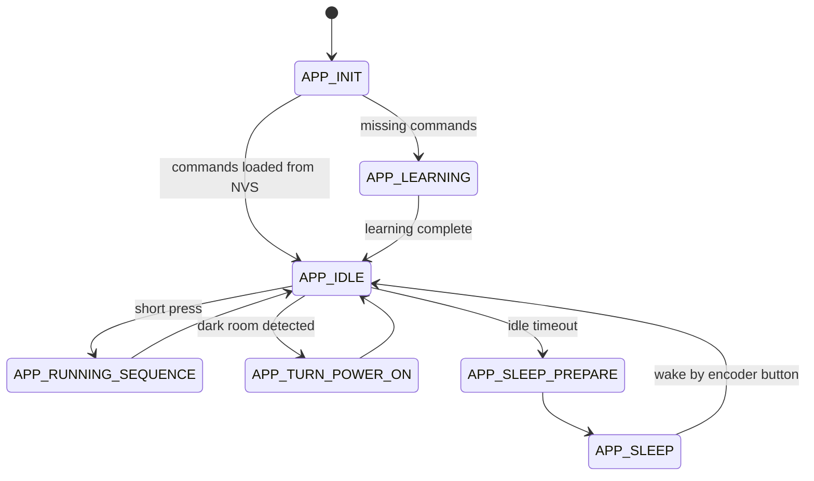

# IR lamp controller

## IR Lamp Controller is an ESP32-S3 based embedded project for controlling an ambient lamp through infrared commands.

The controller learns IR commands from the original remote, stores them in NVS flash memory, and replays them using an IR LED. This allows simple remote commands to be combined into higher-level lighting scenes.

The project is built with ESP-IDF and focuses on embedded firmware architecture, IR signal handling, persistent storage, finite state machine design, sensor-based automation, and low-power behavior.

The project is built with ESP-IDF and focuses on embedded firmware architecture, IR signal handling, persistent storage, finite state machine design, sensor-based automation, and low-power behavior.

## Features
* IR command learning from the original remote
* IR command replay using an IR LED
* Persistent command storage in NVS flash
* Scene selection using a rotary encoder
* Scene enter/exit logic to avoid overlapping modes
* LDR-based automatic lamp power-on when the room becomes dark
* Light sleep mode after inactivity
* Long press reset to clear learned commands and re-enter learning mode
* FSM-based application structure

## Workflow
On first startup, the controller checks whether the required IR commands are already stored in NVS.

If commands are missing, the controller enters learning mode. In this mode, the user teaches the ESP32-S3 each required command from the original remote. After each command is captured, it is saved to NVS.

After learning is complete, the controller enters idle mode. From this state, the user can select scenes using the rotary encoder and run the selected scene with a short press. A long press clears saved IR commands and returns the device to learning mode.

The LDR sensor is used to detect low ambient light. When the room becomes dark enough and the lamp is assumed to be off, the controller sends the power command automatically.

After a period of inactivity, the controller enters light sleep mode and wakes up using the encoder button.

## States diagram

## Video
[placeholder]() 

## Usage
1. Flash the firmware to the ESP32-S3.
2. On first boot, teach the required IR commands using the original remote.
3. After learning is complete, the commands are stored in NVS.
4. Rotate the encoder to select a scene.
5. Press the encoder button to run the selected scene.
6. Long press the encoder button to clear saved commands and restart learning mode.

## Known issues
* The controller does not receive feedback from the lamp, so the lamp state is internally assumed. If original controller is used, controller won't know either.
* Lamp modes behave as toggles.
* IR signal depends on LED position and distance.
* Current wakeup is handled only by encoder button, so ldr won't turn on lamp yet.  

## Future Improvements
* OLED display for selected scene and system state
* Web interface for scene control
* Better IR signal strength using an optimized LED driver
* Saving the last active scene in NVS
* Sleep improvements 
* Deeper behaviour with LDR
